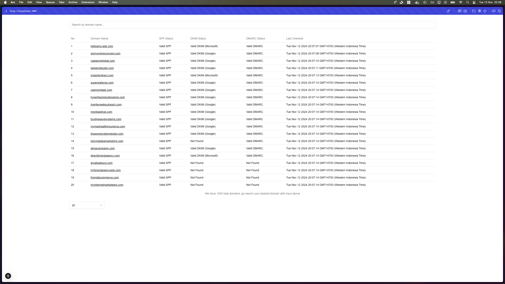

# DNS Resolver Project

Welcome to the DNS Resolver project! This application is designed to provide streamlined server and client functionality using Docker for quick and easy setup.



## Getting Started

Follow these instructions to get the project up and running on your local machine.

---

### Prerequisites

- **Docker**: Ensure that you have Docker installed on your machine.
- **Node.js**: Required for running npm commands.

---

## How to Run Locally

1. **Clone this repository**
   ```bash
   git clone https://github.com/Sofrosine/dns-resolver-list-express-next.git
   
2. **Navigate to project repository**
   ```bash
   cd dns-resolver-list-express-next

3. **Build and start application using Docker Compose**
   ```bash
   docker compose up --build -d

4. **Run database migrations Navigate to the server directory and execute the migration command**
   ```bash
   cd server && npm run migrate

5. **Access the application.**
   Once everything is set up and running, the app will be available at:
   ```bash
    Server: http://localhost:3000
    Client: http://localhost:3001
   ```
   
---

## Project Structure

- **`server/`** - Contains backend code, API logic, and database migrations.
- **`client/`** - Contains frontend code (Next.js) and UI components.

---

## Useful Commands

- **Stop Docker Compose**:
  ```bash
  docker compose down
  ```

- **Start Docker Compose**:
  ```bash
  docker compose up --build -d
  ```
  
---

## Technical Details

- **Backend**: Node.js, Express
- **Frontend**: Next.js
- **Database**: PostgreSQL (running inside a Docker container)

---

## NOTES
If the database still empty after you running for the first time, you can re-run the docker compose
